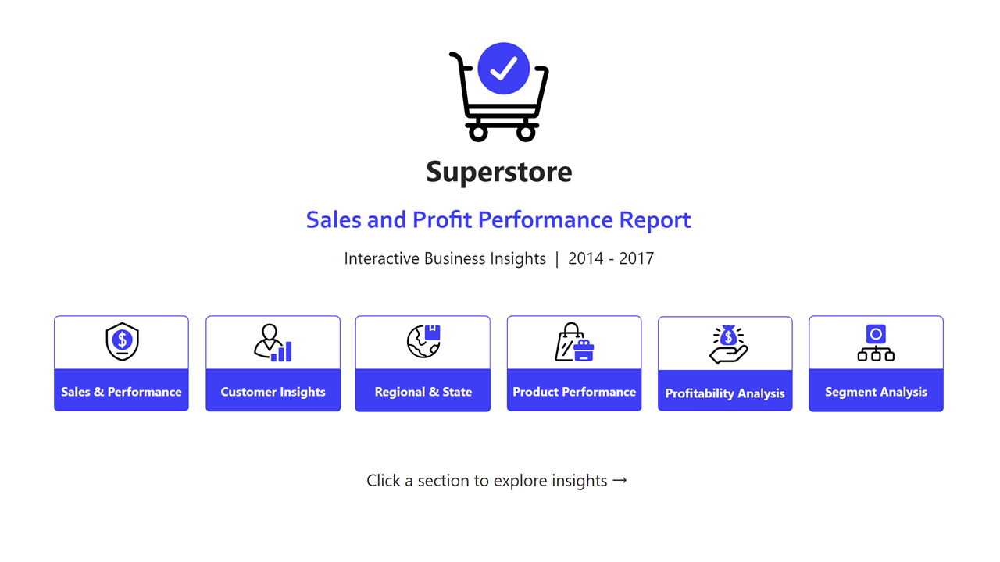
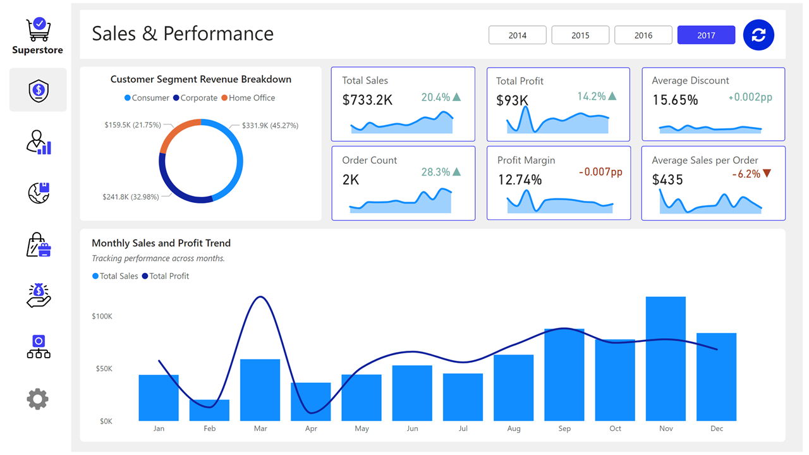
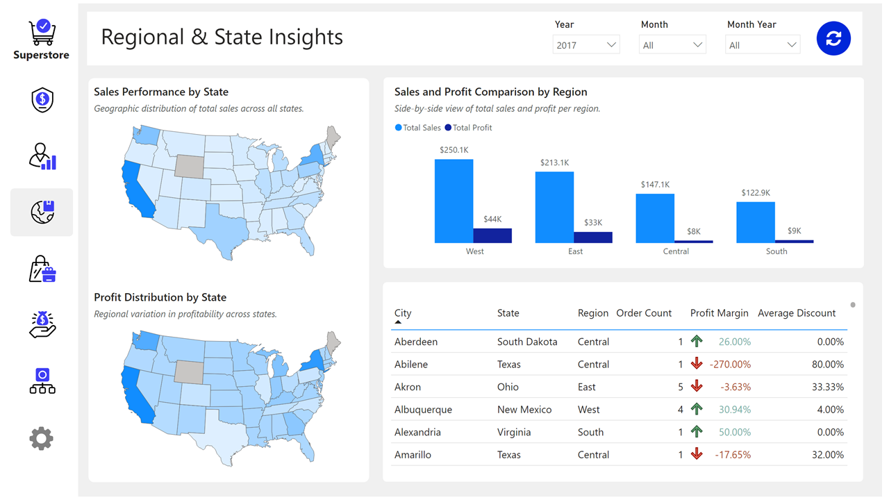
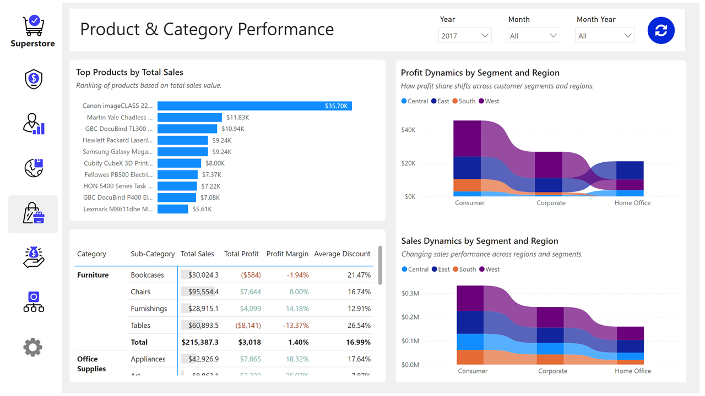
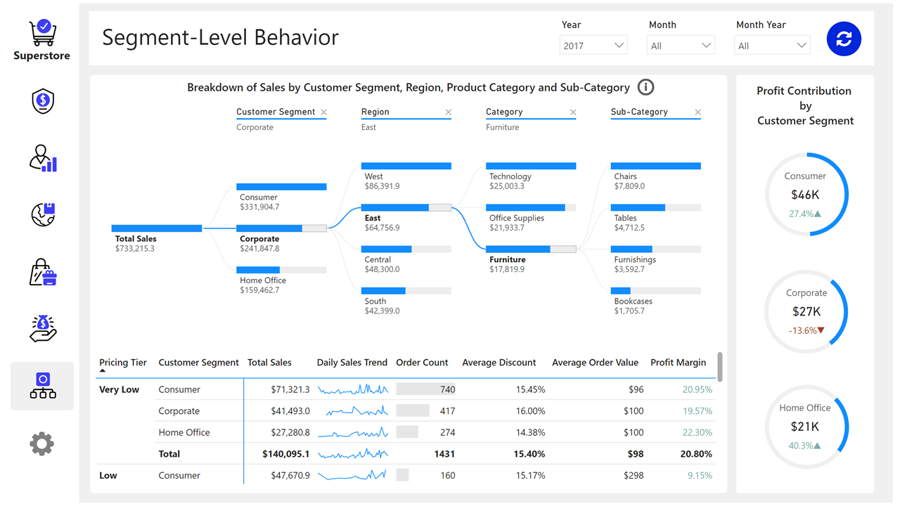

# Superstore Sales & Profit Performance Dashboard

This repository contains a comprehensive Power BI dashboard analyzing Superstore sales and profitability across the United States from 2014 to 2017. The interactive report provides actionable business insights through visual analytics, enabling stakeholders to explore sales trends, regional performance, product profitability, and customer segment behavior.

The dashboard is designed with a modern, user-friendly interface and includes multiple pages for deep-dive analysis across various business dimensions.

## 🎯 Objectives
- Provide an interactive overview of sales and profit performance over time
- Analyze customer segmentation and regional distribution of revenue
- Identify top-performing products and categories
- Examine profitability trends and discount impacts
- Enable granular filtering by segment, region, category, and sub-category

## 📈 Dashboard Pages

### 1. Superstore Overview

- Interactive navigation menu with sections:
  - Sales & Performance
  - Customer Insights
  - Regional & State
  - Product Performance
  - Profitability Analysis
  - Segment Analysis
- Period: 2014–2017
- Total metrics at a glance

### 2. Sales & Performance

- Customer segment revenue breakdown (Consumer, Corporate, Home Office)
- Year-over-year growth indicators
- Monthly sales and profit trend visualization
- Key metrics:
  - Total Sales: $733.2K
  - Total Profit: $93K
  - Profit Margin: 12.74%
  - Average Discount: 15.65%

### 3. Regional & State Insights

- Sales performance by state (geographic distribution)
- Profit distribution across states
- Regional comparison (West, East, Central, South)
- Detailed city/state table with profit margins and discounts

### 4. Product & Category Performance

- Top products by total sales
- Profit dynamics by segment and region
- Sales dynamics by segment and region
- Visual comparison of product categories

### 5. Profitability Analysis

- Profit contribution by product sub-category
- Discount vs. Profit relationship scatter plot
- Profit growth trend over time (2017 monthly view)
- Interactive year/month filters

### 6. Segment-Level Behavior

- Breakdown of sales by customer segment, region, category, and sub-category
- Profit contribution by customer segment
- Pricing tier analysis with key metrics per segment
- Daily sales trends and order value insights

## 🛠️ Tools & Technologies
- Power BI – Dashboard development and visualization
- DAX – Measures and calculated columns
- Power Query – Data transformation and cleaning
- Excel/CSV – Source data preparation

## 📂 Repository Structure
```bash
Superstore-BI-Dashboard/
│
├── README.md                       # Project documentation (this file)
├── data/                           # (Optional) Sample or anonymized datasets
│   └── superstore_sample.csv
│
├── images/                         # Dashboard screenshots
│   ├── Slide1.PNG                  # Overview page
│   ├── Slide2.PNG                  # Sales & Performance
│   ├── Slide4.PNG                  # Regional Insights
│   ├── Slide5.PNG                  # Product Performance
│   ├── Slide6.PNG                  # Profitability Analysis
│   └── Slide7.PNG                  # Segment Analysis
│
├── pbix/                           # Power BI source files
│   └── Superstore_Dashboard.pbix   # Main Power BI report
│
└── docs/                           # Additional documentation
    └── project_guide.md            # Original project instructions

```

## 🔍 Key Findings & Insights

### 📌 Sales Performance
- Total Sales: $733.2K with 2K orders
- Top Segment: Corporate ($331.9K, 45.27% of sales)
- Growth: Sales increased by 20.4% and profit by 14.2% over the period

### 📌 Regional Insights
- Highest Sales: West region ($250.1K)
- Highest Profit: East region ($44K)
- Lowest Profit Margin: South region ($8K profit on $122.9K sales)

### 📌 Product Insights
- Top Product: Canon ImageCLASS 2200 ($35.7K sales)
- Furniture category shows strong sales but requires profitability review

### 📌 Profitability Drivers
- Average discount: 15.65%
- High discounts negatively correlate with profit in scatter analysis
- Copiers & Accessories are the most profitable sub-category

### 📌 Customer Segmentation
- Home Office segment shows highest profit growth (40.3% ▲)
- Corporate segment profit declined (-13.6% ▼) despite high sales
- Consumer segment has the largest sales volume but moderate profit growth

## 🚀 How to Use
1. Open the Power BI file (Superstore_Dashboard.pbix) in Power BI Desktop
2. Navigate using the interactive menu on the first page
3. Use filters to drill down by:
  - Year/Month
  - Customer Segment
  - Region/State
  - Product Category/Sub-Category
4. Hover over visualizations for detailed tooltips
5. Click on charts to cross-filter other visuals

## 📊 Recommendations
1. Review discount strategy for low-margin regions (South, Central)
2. Focus on profitable segments: Home Office shows strong growth
3. Optimize product mix: Reduce low-margin items in Corporate segment
4. Regional strategy: Leverage West region's sales strength to improve profitability

___
_This dashboard was developed as part of a portfolio project to demonstrate skills in data visualization, business intelligence, and analytical storytelling using Power BI._


